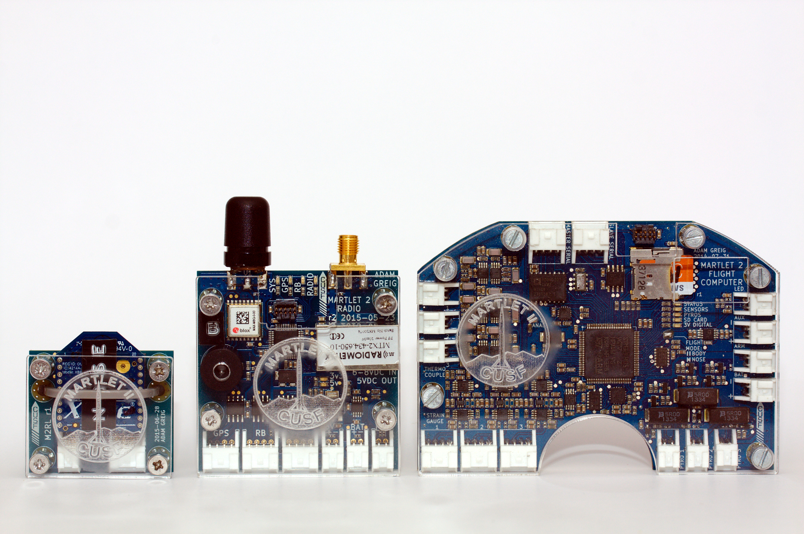
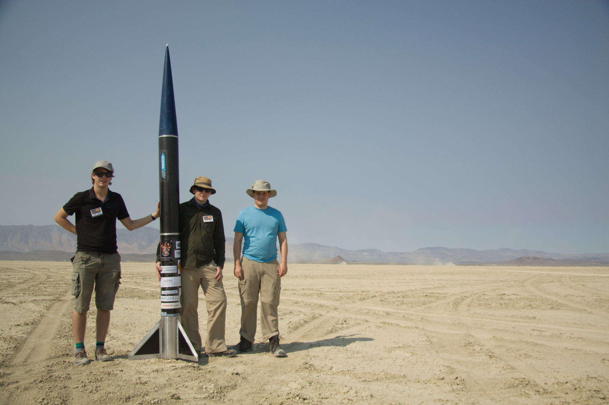

\fancypagestyle{plain}{
\renewcommand{\headrulewidth}{0pt}
\fancyhf{}
\fancyhead[L]{\includegraphics[width=3cm]{cusf_logo}}
\fancyhead[R]{\includegraphics[width=3cm]{m2_logo}}
\setlength\headheight{50pt}
}

\clearpage
\setcounter{page}{1}

# Introduction

Martlet 2 was an amateur rocket designed, built, and launched by Cambridge 
University Spaceflight in 2013-2015. It was intended to reach a speed of around 
1km/s and an altitude of around 15km, establishing a new UK amateur altitude 
record.

After a scrubbed launch due to weather in October 2014, Martlet 2 was launched 
in October 2015 from Black Rock Desert, Nevada, USA. An anomaly occurred three 
seconds into the flight, resulting in the rapid and thorough destruction of the 
rocket including the avionics.

A custom set of avionics was designed for Martlet 2. After the scrubbed launch, 
some were updated to address issues in the original designs. This document is a 
postmortem and a retrospective of those avionics, reviewing the original design 
and evaluating the choices made and lessons learnt for future avionics 
programmes.

This postmortem is concerned with the avionics and their integration with the 
larger rocket system, but will not discuss matters solely related to the rocket 
or other components, nor will it detail the flight anomaly except insofar as it 
relates to the avionics design and possibility for future improvements.

\newpage

## Objectives

The original objectives for the avionics were, in priority order:

1. Control the recovery system deployment
1. Downlink rocket position information for recovery purposes
1. Record vital rocket parameters (altitude, velocity, acceleration, location)
1. Downlink additional information
1. Record additional sensors, including inertial, strain, and temperature

\begin{shaded}
Think carefully about precise objectives and priority. Lots of time was wasted 
on things that were not mission critical to the detriment of those that were.
\end{shaded}

# Hardware

The early design called for a pyrotechnic board `M2P` to control the recovery 
system, a radio board `M2R` for downlinking position, and a datalogging board 
`M2D` to record flight data. The decision was made early on to combine the 
pyrotechnic board and the datalogging board into a flight computer `M2FC`, as 
they required very similar sensors and software. In retrospect, it seems likely 
that keeping these separate would have been beneficial: the recovery system 
could be simpler and thus more reliable, and the datalogger could be worked on 
in isolation allowing better collaboration with less risk of compromising the 
main objectives.

\begin{shaded}
Consider maintaining modularity even when integration is tempting; it preserves 
isolation and separation of concerns.
\end{shaded}

Little thought was put into the whole system design early on, such as 
interlinking the avionics and regulating and distributing the power supply. 
Much of this had to be designed once the rest of the avionics were finalised, 
which led to a worse solution.

\begin{shaded}Consider how individual components will form the complete system 
before finalising their design.\end{shaded}

## Hardware Overview

## PCB Design & Manufacture

All PCB design was performed in KiCAD. Setting up a common library of component 
symbols and footprints from the beginning would probably have saved time.
The current procedure for carefully checking schematic and board layout led to 
only a single mistake in production: the powered isolator `ADuM5201` was given 
a normal-width `SOIC16` footprint where the datasheet called for a wide 
variant. Luckily the chip was easily modified be folding the legs around so 
this did not present a serious issue in production.

\begin{shaded}Careful and thorough checking of the PCB designs, including 
against the CUSF checklist, resulted in very few issues on a complicated 
design.\end{shaded}

Manufacture was by reflow soldering and had no issues beyond a few small solder 
bridges which were readily reworked. Again standard procedures seem to have 
worked very well here.

### Analogue Section

### Pyrotechnic Drivers

### Inertial Measurement Unit

* Magno was unreliable
* So was gyro
* I2C to blame?
* Accels calibrate offset obviously, need to rotate for scale

### SD Card

### Radio Power Amplifier

### Inter-Board Communications

### Arming Concept

## Other Hardware

Beyond `M2FC` and `M2R` there were several other electronics systems on Martlet 
2, some integrated with the main avionics.

### Cameras

We originally fitted a GoPro Hero camera and a Mobius ActionCam, both activated 
manually (the GoPro over the radio) before launch. After the 2014 scrub, the 
camera plan was updated to use only "808 #16" cameras, configured to begin 
recording when power is applied. They were then connected to `M2FC`'s auxiliary 
power output, so they began recording when the rocket was armed. This system 
worked very well and made final arming easier. Unfortunately during the flight 
anomaly the cameras were broken up and the SD cards were lost.

\begin{shaded}Small 808 cameras worked well. Activating them via the main 
avionics was a good idea. In future, secure the SD cards as well as possible, 
perhaps by gluing.\end{shaded}

### Backup Tracker

As a backup locating device, a Joey tracker was installed in Martlet 2 as well. 
It had its own independent power supply, GPS, and radio. While this was not 
required in the event, its presence was reassuring and there is no reason to 
believe it would not have worked (had it not been torn to pieces during 
flight).

\begin{shaded}Use a totally separate and independent tracker for 
backup.\end{shaded}

### Recognised Altimeter

To ensure the altitude reached would be recognised for record keeping purposes, 
a commercial altimeter (a PerfectFlite model) was fitted. This was necessary 
but otherwise did not add a huge amount to the system. No particular issues 
were encountered here.

### Satellite Modem

`M2R` connected to a RockBLOCK Iridium satellite modem, which could relay 
position information from anywhere in the world. While a nice backup, this was 
probably not necessary at the launch site (a complete flat) and added 
complication to the avionics design and mounting. In the event the satellite 
modem did not have a chance to send any messages. In theory it is quite 
functional and would be useful on a future project where this level of backup 
communication is required.

\begin{shaded}Satellite modems can work well but consider if it is really 
required for a given flight, compared to the mass, power, and complexity 
cost.\end{shaded}

### Radio Power Amplifier

After the 2014 scrub, the power amplifier was moved off `M2R` and into its own 
box. This design worked well and the amplifier survived the flight. It's 
possible that in future returning to an integrated amplifier once the design is 
proven would have worked well too, simplifying avionics wiring.

### `M2RL`

### Strain Gauges and Thermocouples

* Assembly issues
* Potential to short out excitation, putting whole flight computer at risk

### Power Supply & Distribution

The power distribution design was not considered until after the majority of 
the avionics were finalised. Each piece of avionics had been designed with the 
assumption that somehow around 6-7V of battery power would be available, as an 
appropriate voltage to regulate down to 5V and 3.3V for electronics systems 
while also providing enough margin to reliably fire the Metron protractors used 
in the recovery system. The design was therefore to use 4xAA lithium primary 
cells in a battery, connected to `M2FC`, which would then power the rest of the 
system once armed through the `AUX` connector.

In the original design, `M2R` had its own separate battery supply and thus 
arming/power switch. In the 2014 scrub update, `M2R` is instead powered on the 
`AUX` bus from `M2FC`, which uses both battery packs in parallel to give 
maximum capacity for the combined system. This new design allowed for a single 
power switch which reduced complexity.

\begin{shaded}Don't use separate batteries for otherwise interdependent and 
connected systems, it just increases complexity. Central power switching is 
nice.\end{shaded}

Using lithium primary cells had some advantages for mass, power density, 
availability, and transport. CU Spaceflight have successfully used these cells 
for many varied missions so they were an obvious choice here. Being able to 
install a known-fresh set of batteries immediately prior to flight was 
reassuring, and being able to purchase these batteries at most large shops 
worldwide was likewise useful.

However, they necessitate battery holders which were all either difficult to 
mount securely, awkwardly shaped, or both. Reliable connections to the cells 
under the high acceleration conditions expected in flight was a pressing 
concern. In the original design, large Bulgin holders were used, but they were 
very awkward to fit in the mounting design. Post-scrub, smaller regular holders 
were used, but they did not provide any mounting points and were essentially 
friction fitted into a smaller compartment. Neither design was ideal, although 
it appears that the eventual design did provide power during acceleration.

In future it would be well worth considering a lithium ion rechargable main 
system battery with a dedicated power distribution board that can monitor and 
provide power to system components individually. Voltages could be regulated to 
some extent centrally, and supply currents could be measured, providing useful 
debugging information. Recharging allows for shore power to be used via an 
umbilical, which means the rocket may be powered up and on the pad for long 
durations, reducing urgency once padded up.

\begin{shaded}Give more thought to power supply design and distribution, 
including the option of rechargable batteries and an umbilical providing shore 
power.\end{shaded}

### Cabling & Connectors

* Spec55 is wonderful
* JST PA did a good job
* External connectors in future
* Connector in the airframe?
* Umbilical to shore?

## Mounting & Enclosure

* More enclosed
* Easier to assemble
* No need to open to reprogram etc

## External Switches & Arming

## Human Interface

## Testing

# Software

## Design

### Real-Time Operating System

### Calibration

### Powerup Sequence

### Safety Lockout

### Ignition Detection

### Status Monitoring & Sharing

## Implementation

### Timing

### Testing

## Ground Software

* Would have been nice...

## Collaboration

# Integration

* Mounting holes
* LEDs
* Sensors (SG/TC)
* Antennas
* Cameras
* Don't glue things
    * Really Really Really
    * LED broke off
    * Arming switch broke off
    * Other arming switch broke off
    * Arming key broke off
    * Both cameras broke off eventually
    * Don't glue things

# Recommendations

# Conclusions

